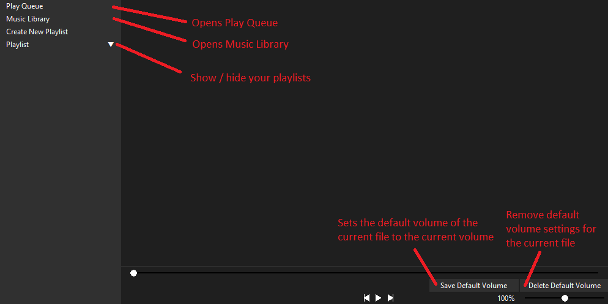
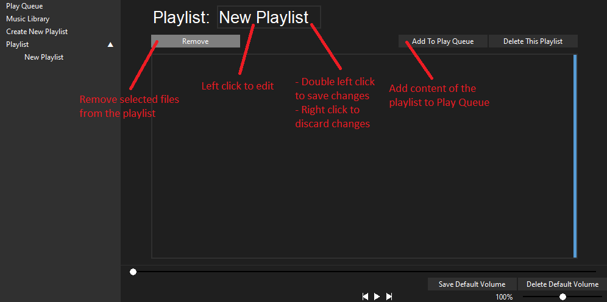
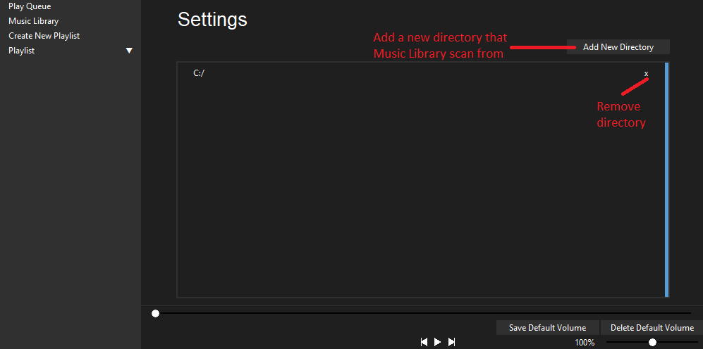

# music-player

A simple Python-based music player built using Tkinter.

## Features

- Plays audio file / files that contain audio data
- Playlists, stores a list of files that can be played quickly in order
- Save default volume, stores the default volume of a file, automatically adjust the volume when loaded

## Installation

Follow these steps to install and run the application on your local mechine:

1. Clone / download the repository
2. Install the required dependencies:
   pip install -r requirement.txt
3. Run main.py

## Usage

- Open the app by running main.py

- Tutorial (Screenshots)

## Request for Feedback

I'd love to recieve feedback from **you**, it helps me to improve my future codes:

1. **Code Structure**:
   - Is the current structure of the codebase clean and maintainable?

2. **Formatting & Style**:
   - Are there any improvements that could be made to the formatting or coding style?

3. **Modularity**:
   - Could the code be broken down into smaller, more reusable functions or modules?
   - Are there areas where the code can be made more DRY (Don’t Repeat Yourself)?

4. **Performance**:
   - Are there areas where the code could be optimized?
   
Feel free to submit **pull requests** with suggestions or improvements, or open **issues** if you find any bugs or potential enhancements.

### How to Provide Feedback

- Open an **Issue** on GitHub: [Link to Issues Page](https://github.com/leesiuhin7/music-player/issues)
- Submit a **Pull Request** with your suggested changes.

## License

This project is licensed under the GNU General Public License v3.0 - see the [LICENSE](LICENSE) file for details.

